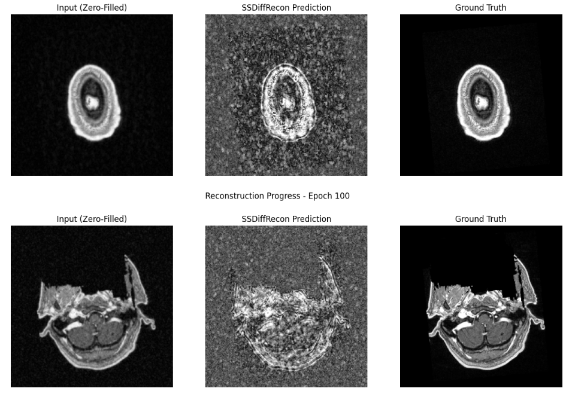
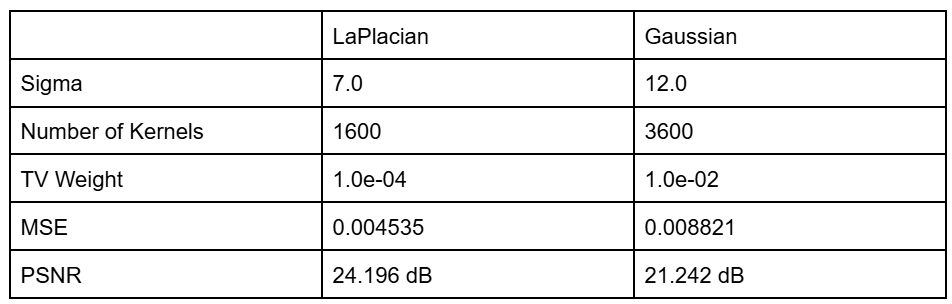
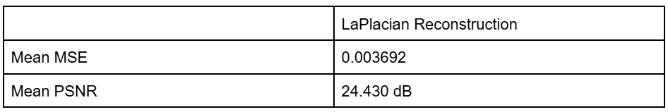
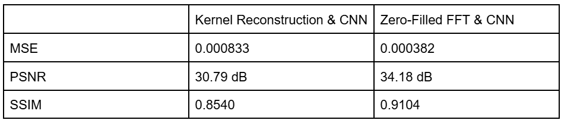
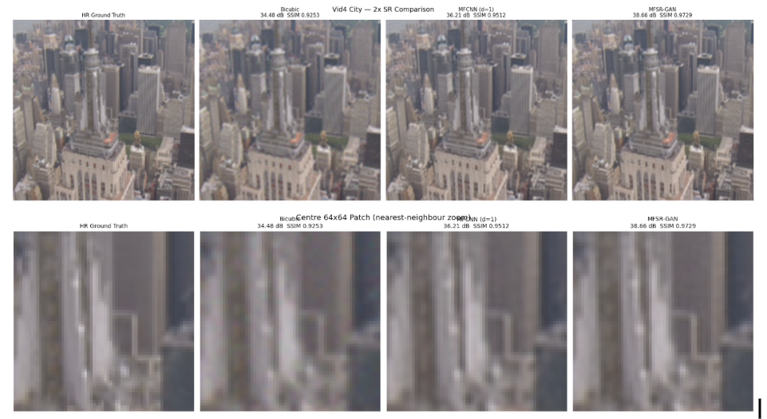

# Overview
Thus far, our models have been trained on the ground truth images in order to predict the correct reconstruction. This model builds on diffusion models by using self-supervised learning through training solely on the undersampled k-space filters, making it more applicable to medical contexts with reduced data availability. Results were less accurate overall than the original diffusion model implementation, which we expect since the model is solving a harder problem. We were not able to match the accuracy from the paper due to our smaller training dataset and shorter training time, though this is a working prototype for pushing MRI reconstruction in the direction of autoresearch.

# Model
Our model is based on SSDiffRecon (Korkmaz et al. 2024). We used a split k-space masking strategy, where M is the undersampled mask, Mr is a random sample of M used to train the model, and Mp is M / Mr, used to test model performance. We start with zero-filled FFT and use cross-attention transformers to denoise, implementing data consistency to ensure no measured k-space values are overwritten. Notably, this model uses unrolled denoising blocks instead of the U-Net Architecture typically used in medical applications. We follow the same architecture as the paper, changing a few key implementation steps:
- Sigmoidal activation function: We implemented a sigmoidal activation function to constrain the output to the [0,1] range, preventing extremely bright points in k-space from dominating the image and making model improvements clearer.
- Cosine Annealing Scheduler with warmup: We start with a linear scheduler before switching to cosine annealing so that the model can learn the general shape of the image before dropping the learning rate.
- Frequency Weighted Loss: We implemented focal frequency loss because the model had a lot of trouble initially filling in details - rather, it duplicated the input with minimal changes.
We used an Adam optimizer for self-supervised training with betas = (0.9, 0.999), learning rate 5e-5, and Mr sampled from M using uniform distribution by taking 8% of measured points. We ran 100 epochs with 20 being reserved for the warm-up.

# Results
Using Original Implementation Steps from Paper
We originally used the exact implementation as in the paper (alpha = 0.002,
Loss function: L⁢(θ)=𝔼t,𝐱0,ϵ⁢[‖ϵ−ϵθ⁢(α¯t⁢𝐱0+1−α¯t⁢ϵ,t)‖2], 

cosine annealing scheduler with no warmup, and no constraints on output), which caused a ‘false’ low loss where the model failed to make many changes from the zero-filled input. We report loss = 0.074, MSE = 0.002, SSIM = 0.427, and PSNR = 26.12 dB.

Using Implementation Steps Above
Our changes were in an effort to see the model ‘do something,’ even if reconstruction quality declines. We report frequency-weighted loss of 0.167, MSE = 0.110, SSIM = -0.05, and PSNR = 9.59 dB. Though the loss is relatively low, the near-zero SSIM reflects the model’s difficulty in actually creating an image that is similar to the ground truth from the human eye.

# General Images
General Images:
So far, all of our reconstruction techniques have been on MRI images. However, since none of us are doctors, we are also expanding our setup to general images. We use the Oxford-IIIT Pet Dataset which includes natural RGB images of animals. Unlike the MRI images, these images contain color, edges, and texture that makes the reconstruction assumptions slightly different than the MRI reconstruction assumptions and is even more challenging when sampling from masked Fourier coefficients. 
The first step was to determine the type of kernel and kernel hyperparameters. We trained across 21 images to keep computation time doable and tested both LaPlacian and Gaussian kernels. These were the results:

As you can see, the LaPlacian kernel achieved a lower MSE and PSNR compared to the Gaussian kernel, so we will use a LaPlacian kernel with those hyperparameters for the reconstructions. This is already different from the MRI reconstruction, which preferred a Gaussian kernel for its reconstruction. 
Using the LaPlacian kernel, we next reconstructed our test images using these parameters. We also constructed the zero-filled FFT reconstruction as a baseline to achieve these results:

Representative test slices can be seen here:

Similar to the MRI images, zero-filled FFT also achieved a higher PSNR compared to the kernel reconstruction. 
Next, we trained a residual CNN to correct only the directions that were not already from the undersampled Fourier transform, to make sure the CNN wasn’t reconstruction directions that were from the true image. We did this for both the kernel reconstruction and the zero-filled FFT baseline. We added the structural similarity index as an evaluation metric for this step as well and these were the results:

Here are results for a representative test index:

Again, the zero-filled FFT baseline achieved a better result with a higher PSNR and SSIM and lower MSE. This is similar to the MRI reconstruction, showing that even though both images have different assumptions about their overall shape and structure, the same reconstruction patterns show the same results.
Finally, we used a diffusion model to compare the kernel reconstruction baseline and the zero-filled FFT baseline. These were the results:
{}diffusion

Here are representative test slices for a visual comparison:

Here, unlike the MRI reconstruction, results between the kernel reconstruction & diffusion were practically the same as the zero-filled FFT reconstruction, where zero-filled FFT reconstruction achieved slightly better evaluation metrics. In the diffusion case for MRIs, the diffusion & kernel reconstruction performed better than the zero-filled FFT & diffusion combinations. Also, these evaluation metrics were worse than they were for the residual CNN, offering another difference (at least in the kernel reconstruction case) compared to MRI images. More research is needed to understand why this difference arises. 

# Multiframe Reconstruction
We have also implemented two types of Multiframe CNN methods which take into account the context of neighboring frames to help strengthen the reconstruction of each frame.
MFCNN (Greaves & Winter, 2016)
A lightweight multi-frame CNN approach. All 5 LR burst frames are bicubic-upsampled to HR size, then concatenated along the channel axis (giving 15 channels for a d=1 window). A simple 5-layer conv net maps this to the SR output. 
MFSR-GAN (Khan et al., CVPRW 2025)
A more sophisticated GAN-based approach with:
- Reference Difference Computation to align frames relative to the base frame
- Deformable convolutions for motion-aware alignment
- Channel attention for multi-frame feature fusion
- RRDB (Residual-in-Residual Dense Block) reconstruction backbone
- Pixel-shuffle ×2 upsampling
- Trained with a relativistic GAN loss + L1 loss
This initial test was done on a standard Vid4 dataset commonly used for multiframe reconstruction. Each frame was downsampled and had noise added to simulate a blurry image.

Comparing this result to trying to reconstruct from a singular image, we see that the multiframe method improves PSNR significantly. Training on a singular frame using the CNN, the PSNR only comes to be 33.49 db compared to the 38.66 db that we get when we use multiframe methods.

# Self-Critique
This model doesn’t match increased accuracy that the researchers reported, likely due to our smaller training set and changes in implementation. We had a lot of difficulty getting the model to make changes since the zero-filled FFT was very accurate to begin with. Giving the model a more difficult objective to solve (with a smaller k-space mask and a stricter data consistency requirement) makes it more difficult for the model to make changes from the input. We should try more aggressive parameter tuning on the original implementation without the sigmoidal normalizer since this caused a sharp drop in reconstruction quality. The model runs very quickly, meaning we can experiment with more epochs and longer warm-up periods for the model to learn the general shape. We also encountered difficulties in trying to train models on large datasets.

We spent a lot of time on data normalization (our first run produced completely black images that required lots of parameter tuning) rather than model refinement, so those are our next steps with this run. 
