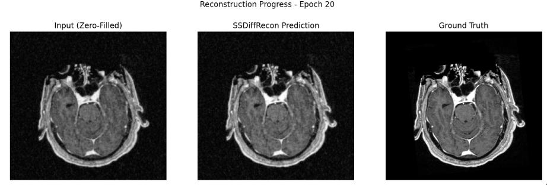

# Overview
Thus far, our models have been trained on the ground truth images in order to predict the correct reconstruction. This model builds on diffusion models by using self-supervised learning through training solely on the undersampled k-space filters, making it more applicable to medical contexts with reduced data availability. Results were less accurate overall than the original diffusion model implementation, which we expect since the model is solving a harder problem. We were not able to match the accuracy from the paper due to our smaller training dataset and shorter training time, though this is a working prototype for pushing MRI reconstruction in the direction of autoresearch.

# Model
Our model is based on SSDiffRecon (Korkmaz et al. 2024). We used a split k-space masking strategy, where M is the undersampled mask, Mr is a random sample of M used to train the model, and Mp is M / Mr, used to test model performance. We start with zero-filled FFT and use cross-attention transformers to denoise, implementing data consistency to ensure no measured k-space values are overwritten. Notably, this model uses unrolled denoising blocks instead of the U-Net Architecture typically used in medical applications. We follow the same architecture as the paper, changing a few key implementation steps:
- Sigmoidal activation function: We implemented a sigmoidal activation function to constrain the output to the [0,1] range, preventing extremely bright points in k-space from dominating the image and making model improvements clearer.
- Cosine Annealing Scheduler with warmup: We start with a linear scheduler before switching to cosine annealing so that the model can learn the general shape of the image before dropping the learning rate.
- Frequency Weighted Loss: We implemented focal frequency loss because the model had a lot of trouble initially filling in details - rather, it duplicated the input with minimal changes.
We used an Adam optimizer for self-supervised training with betas = (0.9, 0.999), learning rate 5e-5, and Mr sampled from M using uniform distribution by taking 8% of measured points. We ran 100 epochs with 20 being reserved for the warm-up.

# Results
Using Original Implementation Steps from Paper
We originally used the exact implementation as in the paper (alpha = 0.002,
Loss function: L⁢(θ)=𝔼t,𝐱0,ϵ⁢[‖ϵ−ϵθ⁢(α¯t⁢𝐱0+1−α¯t⁢ϵ,t)‖2], 

cosine annealing scheduler with no warmup, and no constraints on output), which caused a ‘false’ low loss where the model failed to make many changes from the zero-filled input. We report loss = 0.074, MSE = 0.002, SSIM = 0.427, and PSNR = 26.12 dB.

Using Implementation Steps Above
Our changes were in an effort to see the model ‘do something,’ even if reconstruction quality declines. We report frequency-weighted loss of 0.167, MSE = 0.110, SSIM = -0.05, and PSNR = 9.59 dB. Though the loss is relatively low, the near-zero SSIM reflects the model’s difficulty in actually creating an image that is similar to the ground truth from the human eye.

