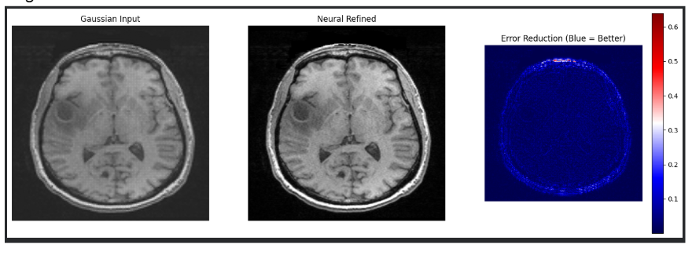
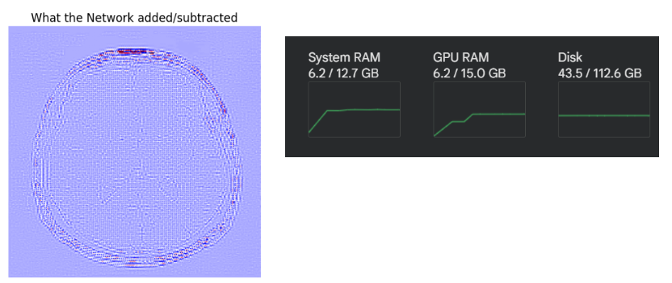
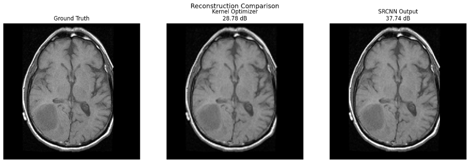
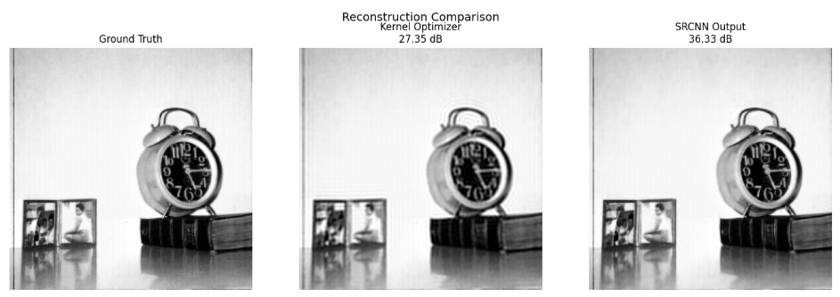

# Brief Summary
We implemented a warm-start neural network approach, using the output from the Gaussian kernel reconstruction as the training data for the neural network. We thought this approach would be a logical next step since the neural network approach was able to increase PSNR and improve image quality, but not as well as the Gaussian kernel reconstruction. We changed a few key aspects of the neural network: (1) implementing a U-Net architecture, which uses convolutional layers of encoder neurons and decoder neurons and is optimized for medical imaging purposes, (2) using a different image to test robustness of the model, since so far we’ve only used a single image, (3) using SSIM as an additional success metric, which better quantifies visual differences.
This approach improved MSE by 0.011, PSNR by 118.170 dB, and SSIM by 0.395. It perfectly recreated the target image though we need to train it on more data to make it useful in medical applications.

Doing some literature review, we also implemented a Super-Resolution Convolutional Neural Network (SRCNN) as a refinement stage. SRCNN is a simple but effective three-layer convolutional neural network originally proposed by Dong et al. (2015) for single-image super-resolution. The architecture consists of:
- Layer 1: 9×9 convolution with 64 filters extracts overlapping image patches and converts them into a feature representation.
- Layer 2: 5×5 convolution with 32 filters learns a nonlinear mapping between low-quality and high-quality feature representations.
- Layer 3: 5×5 convolution with a single output channel reconstructs the final image

# Warm-Start Neural Network Update
The Gaussian reconstruction (using the new image) had a PSNR of 19.581 dB, MSE = 0.011, and SSIM = 0.605, while the warm-start neural network had a PSNR of 137.75, MSE = 0, and SSIM = 1.0, meaning the neural network reconstructed image completely matched the target image.

We can visualize the precise details that the neural network added, leaving areas that already have measured k-space values (light purple) alone while adding in details (dark purple). 

We can see that the warm-start approach uses less memory than training the full NN. 

# SRCNN Update
The SRCNN made the following improvements:
PSNR before SRCNN (kernel optimizer output) : 28.78 dB
PSNR after  SRCNN                           : 37.74 dB
Improvement                                 : +8.96 dB

SSIM before SRCNN (kernel optimizer output) : 0.8786
SSIM after  SRCNN                           : 0.9534
Improvement                                 : +0.0748

Here is also an example with a normal image:

# Next Steps
There are many possible directions in which to take this project:
- Train this new NN on more MRI images so it can generalize as a residual-corrector.
- Incorporate L1 loss in addition to MSE in the training loop to better match current practices in medical literature.
- Apply diffusion models to different types of images where we have a better baseline of what is considered a ‘good’ reconstruction.
- Further explore different SRCNN techniques (pre, post, progressive)
- Exploring multi image super resolution and applying it to MRI scans or video upscaling
- Test different success metrics in the optimization
- Work on training a generalized model

# Self-Critique
We have to take these results with a grain of salt: we successfully trained the network to fill in the details and act as a residual corrector on this single image, which makes sense since it took the target image as input and was trained to fill in the differences between the Gaussian reconstruction and the target image. This requires that we already know what the true image looks like - in medical applications, we wouldn’t have this information. To make this model practically useful, we would need to train it as a residual corrector on many MRI images so it can learn to generalize what details are missing. This is a good first step, but more work needs to be done. We don’t actually know how well this model would act on a real under-sampled MRI scan.
